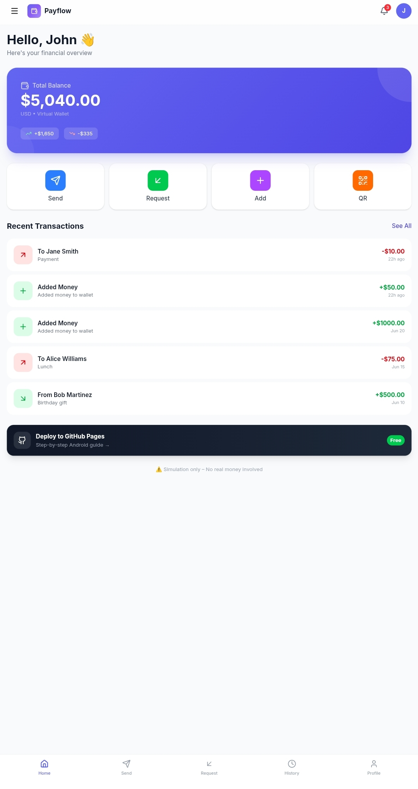
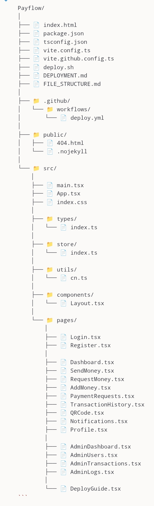

---

# Payflow 🚀

**Payflow** is a modern, responsive **P2P Payment App** user interface built as a frontend demo — designed to simplify transferring money, viewing balances, and managing transactions through a sleek dashboard.

🌐 **Live Demo:** https://vishwajitsingh-rajput-27.github.io/Payflow/

---

## 🧠 About

Payflow provides a clean interface for peer-to-peer payments, allowing users to:

- Send and receive funds
- Track past transactions
- View wallet balance
- Navigate through an intuitive UI

This project focuses on frontend design and user experience. It can be integrated with any backend or API to enable real transaction processing.

---

## 📸 Screenshots

  
*Dashboard overview and transaction history*

---

## 🔧 Features

✔ Responsive UI suitable for desktop and mobile  
✔ Modern dashboard for financial overviews  
✔ Transaction history and activity feed  
✔ Interactive components built with HTML, CSS & JavaScript  
✔ Easy to extend and integrate with real payment APIs

---

## 🛠 Technology Stack

This project is built using:

- **HTML5**
- **CSS3**
- **JavaScript**
- (Optional) Any JS libraries you added

> You can extend the design using frameworks like React, Vue, or integrate with server-side APIs.

---

## 🚀 How to Use

1. Clone the repository  
   ```bash
   git clone https://github.com/vishwajitsingh-rajput-27/Payflow.git

2. Navigate to the folder

cd Payflow


3. Open index.html in your browser or deploy using GitHub Pages as done in the live demo.


> For backend integration, replace placeholders/UI actions with real API calls.


---

📂 File Structure

  
*Complete File Structure*

---


## 🚧 Contributing

1. Fork the repository


2. Create a feature branch

git checkout -b feature-name


3. Commit your changes


4. Push to your branch


5. Open a Pull Request

---

## 📄 License

Distributed under the MIT License. See LICENSE for more information.


---

## ✨ Acknowledgements

Thanks to everyone who supports and contributes. This project is great for showcasing UI/UX design skills and acts as a base for full-stack payment app development.


---

